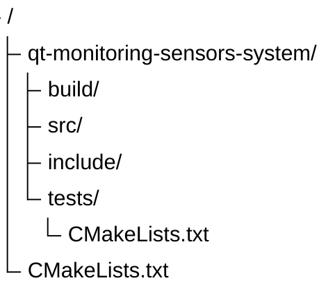
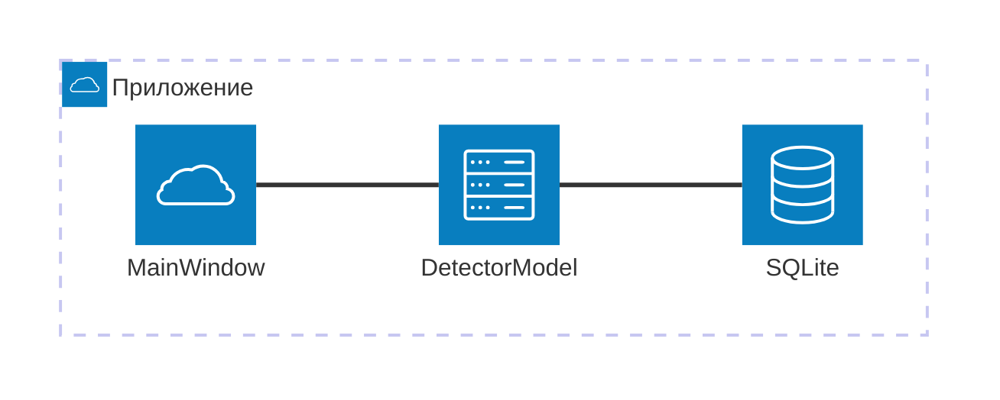

# qt-monitoring-sensors-system
ТЕСТОВОЕ ЗАДАНИЕ: СИСТЕМА МОНИТОРИНГА ДАТЧИКОВ

## План работ

1. Создать проект (QMainWindow) и класс датчика (Detector)
2. Создать реализацию Model-View. (DetectorModel наследованный от QAbstractTableModel)
3. Подключить БД к модели DetectorModel с тестовым набором данных (Например SQLite)
4. Реализовать сортировку (через БД для уменьшения нагрузки)
5. TODO

## Структура проекта

## Архитектура проекта

