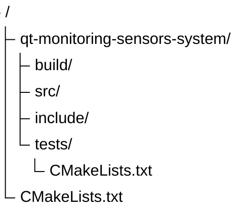
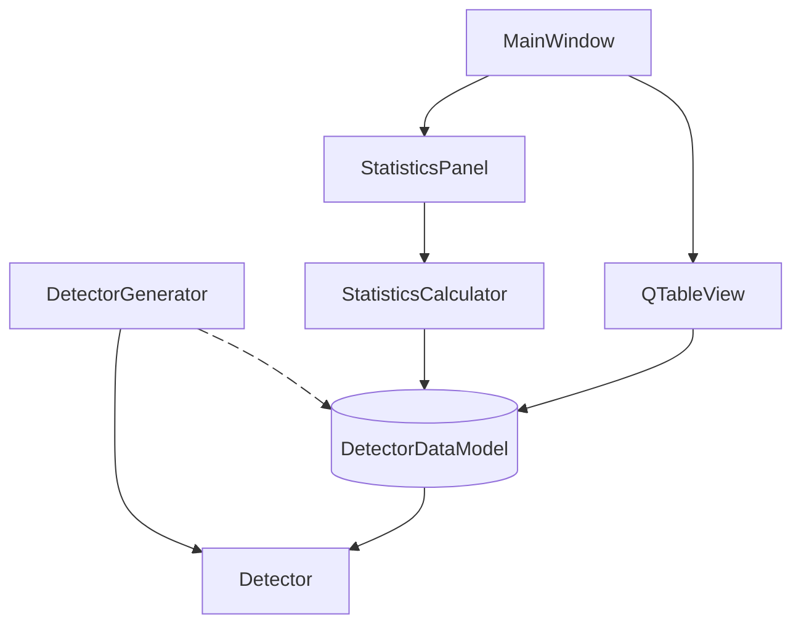

# qt-monitoring-sensors-system
ТЕСТОВОЕ ЗАДАНИЕ: СИСТЕМА МОНИТОРИНГА ДАТЧИКОВ на Qt 5.15 C++

# 📋 План разработки Qt-приложения для мониторинга данных с виртуальных датчиков

## 🧩 1. Предварительная подготовка
- [x] Создать структуру проекта (`CMakeLists.txt`)
- [x] Настроить базовые настройки Qt ( Widgets + Core + Gui)
- [x] Создать папки: `src/`, `include/`
- [x] Установить базовые настройки компилятора и линковщика

---

## 🔧 2. Модуль данных (Data Model)

### 2.1. Класс `Detector`
- [x] Добавить конструкторы: по умолчанию, с параметрами, копирования
- [x] Реализовать getter'ы и setter'ы для всех полей

### 2.2. Модель данных `DetectorDataModel`
- [x] Наследование от `QAbstractTableModel`
- [x] Реализация основных методов:
  - [x] `rowCount()`, `columnCount()`
  - [x] `data()`, `headerData()`
- [x] Добавить метод `addData(const Detector&)` с использованием `QMutex`

### 2.3. Кэширование данных
- [ ] Использовать `QHash` (все 10 000 записей должны оставаться в памяти)
- [ ] Автоматическая валидация через типы Qt (qint64 гарантирует диапазон)
- [ ] Настройка максимального размера кэша (например, последние 20 000 записей)

---

## 🌐 3. Модуль генерации данных

### 3.1. Генератор данных `DetectorGenerator`
- [ ] Наследование от `QObject`
- [ ] Создание метода `start()` для запуска генерации
- [ ] Генерация ID начиная с 1 (уникальные)
- [ ] Генерация случайных значений `float` (например, от -100.0 до 100.0)
- [ ] Генерация текущего времени через `QDateTime::currentDateTime()`

### 3.2. Многопоточность
- [ ] Использование `QThread` для выполнения генерации в фоновом потоке
- [ ] Реализация сигнала `dataGenerated(const Detector&)`
- [ ] Настройка интервала между отправкой данных (например, 10–100 мс)
- [ ] Корректная остановка потока ( сигнал `finished()`, `quit()`, `wait()` )

---

## 📊 4. Модуль статистики

### 4.1. Калькулятор статистики `StatisticsCalculator`
- [ ] Хранение промежуточных значений:
  - [ ] Счетчик датчиков (`int`)
  - [ ] Сумма всех значений (`float`)
  - [ ] Минимальное/максимальное значения (`float`)
- [ ] Реализация метода `update(const Detector&)` с `QMutex` для потокобезопасности
- [ ] Метод `calculateAverage()` для получения среднего значения
- [ ] Сигнал `statisticsUpdated(int count, float avg, float min, float max)`

### 4.2. Обработка событий
- [ ] Подключение сигнала от генератора к слоту калькулятора
- [ ] Подключение сигнала статистики к UI-элементам

---

## 🖥️ 5. Интерфейс пользователя (UI)

### 5.1. `MainWindow` (основной класс)
- [ ] Создание центрального виджета
- [ ] Размещение `QTableView` в центре
- [ ] Добавление панели статистики ( QLabel + layout )
- [ ] Подключение кнопки «Старт/Стоп» для управления генератором

### 5.2. Таблица
- [ ] Использование `QSortFilterProxyModel` для сортировки
- [ ] Настройка delegate'ов для форматирования отображения:
  - [ ] `QDateTime` (короткий формат времени)
  - [ ] `float` (2 знака после запятой)
- [ ] Настройка ширины столбцов и авто-адаптации

### 5.3. Статистика
- [ ] Отображение:
  - [ ] Количество активных датчиков
  - [ ] Среднее значение
  - [ ] Минимум/Максимум
- [ ] Автоматическое обновление при поступлении новых данных

### 5.4. Сигналы/Слоты
- [ ] Соединение `DetectorGenerator::dataGenerated` → `StatisticsCalculator::update` и `DetectorDataModel::addData`
- [ ] Соединение `StatisticsCalculator::statisticsUpdated` → UI-обновление
- [ ] Настройка соединений через `Qt::QueuedConnection` для межпоточности

## 🧪 6. Тестирование и отладка

### 6.1. Тестирование модулей
- [ ] Тест генератора (проверка корректности ID и значений)
- [ ] Тест модели (проверка добавления/удаления данных)
- [ ] Тест статистики (проверка вычислений)

---

## Структура проекта

## Архитектура проекта

