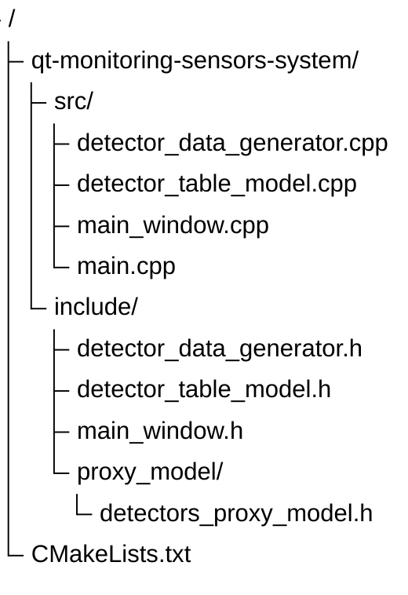
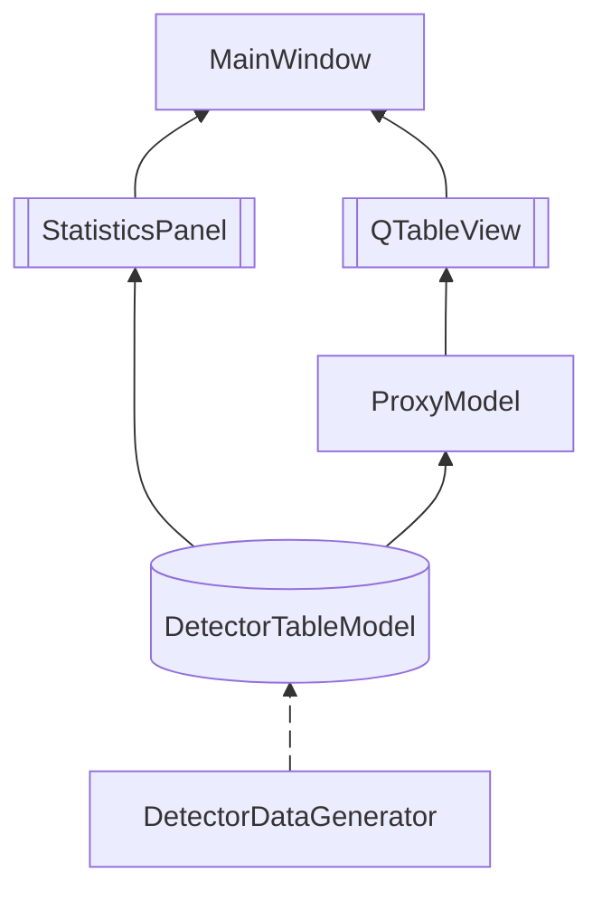

# qt-monitoring-sensors-system
ТЕСТОВОЕ ЗАДАНИЕ: СИСТЕМА МОНИТОРИНГА ДАТЧИКОВ на Qt 5.15 C++

## Инструкция по сборке (требуется qt5-base)
В терминале (в директории проекта `qt-monitoring-sensors-system/`)
```bash
cmake -B build -DCMAKE_BUILD_TYPE=Release
cmake --build build
```
Для Linux
```bash
./build/qt-monitoring-sensors-system
```
Для Windows
```cmd
build\qt-monitoring-sensors-system.exe
```


## Структура проекта



## Архитектура проекта

